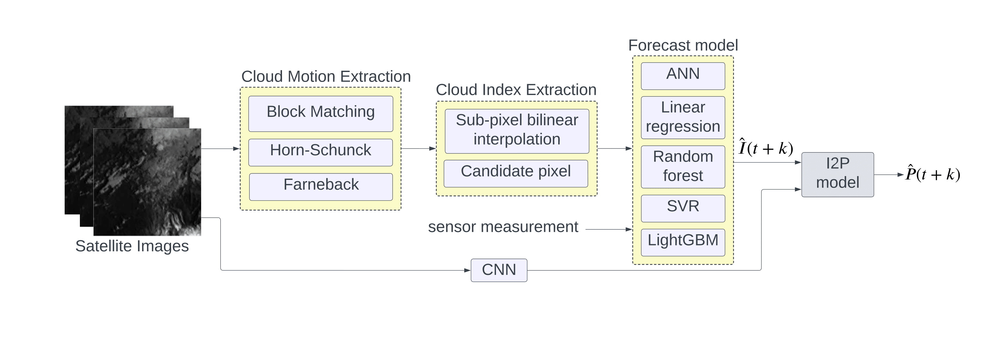

# Intra-day solar power forecasting using cloud images from Himawari satellite

This repository is created for version control of our senior project in `2102499: Electrical Engineering Project` during of August 2022 - May 2023.

Natthapol and I had worked on this project with guidance from Associate Professor Jitkomut Songsiri in my senior year. The objective of this study is to compare the performance of irradiance (I) forecasting between a traditional machine learning (ML) model that uses extracted cloud information features and CNN models that extract spatio-temporal relationships from input cloud image data. The cloud images were received from [Himawari satellite](https://himawari.optemis.space/)  and the measurement data were collected from 56 solar stations across Thailand. Furthermore, the study aims to assess the conversion of forecasted irradiance to generated solar power (P) at each site station. The overall process of our project are shown below.

> CNN structures we used are 3D-CNN and CNN-LSTM.

This repository is composed of the following folders

 - **data** : process, extract feature from raw cloud image data and combining them with other measurement variables.
 - **model_training** : train all ML models.
 - **model_evaluation_graphs_plot** : evaluate model performance using various metrics and contains codes to generate all the graphs in the project report.

The project detail elaborately describes in [report](http://jitkomut.eng.chula.ac.th/group/natanon_nathapong_irradiance_forecast.pdf) (Thai version).

